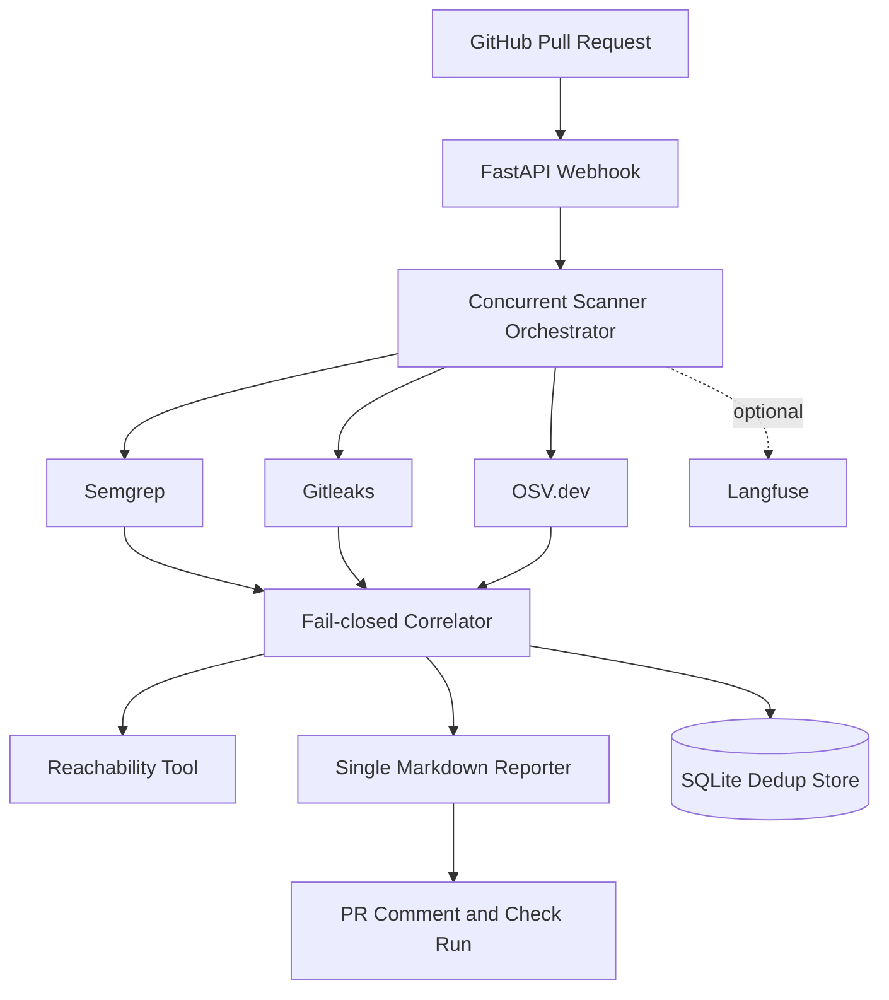

# Security Finding Triage Agent

This project scans a GitHub pull request with Semgrep, Gitleaks, and OSV.dev,
correlates findings with changed-file reachability, and publishes one ranked
PR comment plus a GitHub check run.

## Architecture



## Current runtime design

The scanner wrappers and correlation/reporting path are deterministic. The
OpenAI Agents SDK definitions in `triage_agents` are available as extension
points, but the production path does not ask an LLM to decide whether a merge
should be blocked. This keeps security decisions reproducible.

The system fails closed: a scanner failure or skipped dependency scan blocks
the check and is shown in the report. LOW reachability confidence means manual
review, never “safe.” Secret matches are truncated at the Gitleaks tool layer.

## Local setup

```powershell
py -3.11 -m venv .venv
.\.venv\Scripts\Activate.ps1
pip install -e ".[dev]"
```

Install Semgrep and Gitleaks, then copy `.env.example` to `.env` and configure
`GITHUB_TOKEN` and `GITHUB_WEBHOOK_SECRET`. Langfuse is optional; set
`LANGFUSE_TRACING_ENABLED=true` only when the Langfuse service and keys are
available.

Run the tests:

```powershell
.\.venv\Scripts\python.exe -m pytest -q
.\.venv\Scripts\ruff.exe check .
```

## Run the webhook locally

```powershell
.\.venv\Scripts\python.exe -m uvicorn webhook.app:app --reload --port 8000
ngrok http 8000
```

Configure the HTTPS ngrok URL as a GitHub Pull Request webhook targeting
`/webhook/github`. The webhook validates `X-Hub-Signature-256`, immediately
accepts supported events, clones the PR head commit, runs the scanners, and
posts the result in the background.

## Docker

```powershell
docker compose up --build
```

The application listens on port `8000`; the optional Langfuse UI listens on
port `3000`. Do not use the example production secrets unchanged.

## Limitations

Reachability is intentionally MVP-level: same-file findings are HIGH
confidence, direct textual imports/references are MEDIUM, and missing evidence
is LOW. It is not a complete language-aware call graph. A real GitHub test
also requires repository permissions, configured credentials, and a public
webhook tunnel.